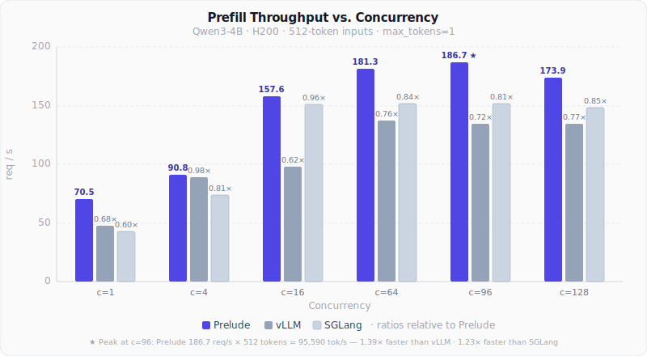
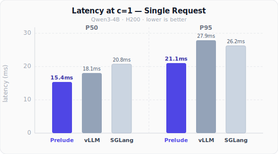

<p align="center">
  <picture>
    <source media="(prefers-color-scheme: dark)" srcset="assets/logo-dark.svg">
    
  </picture>
</p>

<p align="center">
  Fast LLM inference engine in Rust. Optimized for prefill throughput.
</p>

---

## Performance

**GPU (H200, Qwen3-4B)**

<p align="center">
  
  
</p>

- **Peak throughput**: 186.7 req/s × 512 tokens = **95,590 tok/s** — **1.39× vs vLLM**, **1.23× vs SGLang** (at c=96)
- **Latency (c=1)**: P50 **15.4ms** · P95 **21.1ms** — vs vLLM 18.1ms/27.9ms, SGLang 20.8ms/26.2ms

*512-token inputs, max_tokens=1, 200 requests per concurrency level, engines isolated on separate H200 GPUs.*

---

## Quick Start

### Prerequisites

- **Rust** (stable, 1.85+)
- **CUDA Toolkit** (for GPU)
- **CMake** >= 3.18 (for oneDNN CPU backend)

### Build

```bash
# GPU with Flash Attention v4 + v3 (Hopper, recommended)
cargo build -p prelude-server --release --features flash-attn-v4,flash-attn-v3,onednn

# GPU with Flash Attention v2 (Ampere/Ada)
cargo build -p prelude-server --release --features flash-attn

# CPU only with oneDNN BF16 GEMM
cargo build -p prelude-server --release --features onednn
```

### Run

```bash
# GPU
CUDA_VISIBLE_DEVICES=0 ./target/release/prelude-server \
  --model Qwen/Qwen3-4B --port 8000

# CPU
PRELUDE_DEVICE=cpu ./target/release/prelude-server \
  --model Qwen/Qwen3-0.6B --port 8000
```

### Query

```bash
curl http://localhost:8000/v1/chat/completions \
  -H "Content-Type: application/json" \
  -d '{
    "model": "Qwen/Qwen3-4B",
    "messages": [{"role": "user", "content": "Hello!"}],
    "max_tokens": 64
  }'
```

## Supported Models

| Architecture   | Models                            | GPU Backend | Continuous Batching |
|----------------|-----------------------------------|-------------|---------------------|
| Dense          | Qwen3 (0.6B–32B)                 | FA4 / FA3 / FA2 | Yes             |
| MoE            | Qwen3-MoE (30B-A3B)              | FA3 / FA2   | Yes                 |
| Hybrid         | Qwen3.5 (0.8B–27B, dense + MoE)  | FA3         | Yes                 |
| Hybrid         | Qwen3-Next (80B-A3B)             | FA3         | Yes                 |
| Classification | Qwen3-Reranker, Gemma3           | FA3 / FA2   | Yes                 |
| Embedding      | Qwen3-Embedding                  | FA3 / FA2   | Yes                 |
| Quantized      | GGUF (Qwen3, LLaMA, Gemma, Phi3) | CPU only    | No                  |

## API

OpenAI-compatible endpoints:

| Endpoint                    | Description          |
|-----------------------------|----------------------|
| `POST /v1/chat/completions` | Chat completion      |
| `POST /v1/completions`      | Text completion      |
| `POST /v1/embeddings`       | Text embeddings      |
| `POST /classify`            | Classification       |
| `GET  /v1/models`           | List models          |
| `GET  /health`              | Health check         |

Compatible with OpenAI SDK, vLLM, and SGLang clients. Supports streaming, logprobs, and stop sequences.

## License

Apache-2.0
