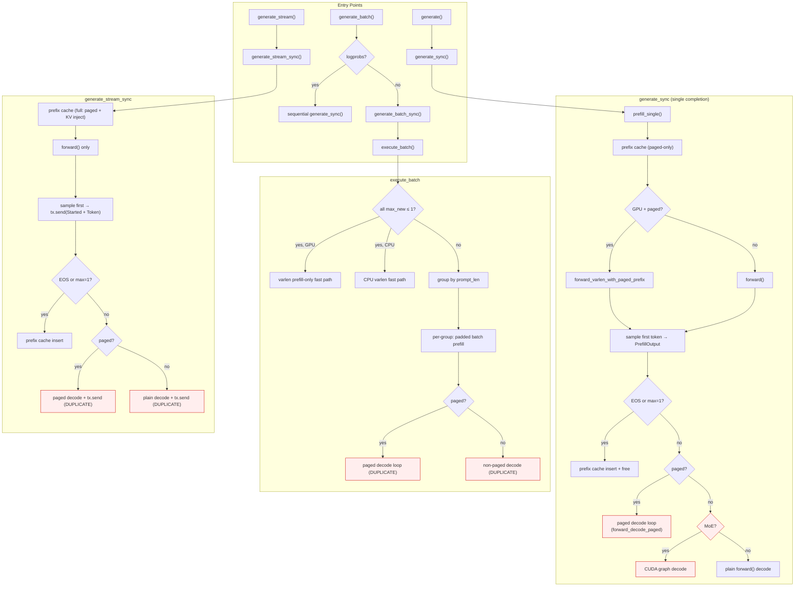

# Generate Logic Flow

## Current State (2894 lines)

```
generate.rs line budget:

  41-282    prefill_single()                  ~240 lines  (extracted)
 284-893    generate_sync()                   ~610 lines  (uses prefill_single + inline decode)
 894-941    generate_batch_sync/pretokenized    ~50 lines  (thin wrappers)
 943-2378   execute_batch()                  ~1435 lines  (3 prefill paths + 2 decode paths)
2380-2864   generate_stream_sync()            ~485 lines  (completely independent prefill + decode)
2866-2894   helpers (build_sampling/is_eos)     ~30 lines
```

### What's duplicated

The same decode loop is written **5 separate times**:

| Location | Lines | Description |
|---|---:|---|
| `generate_sync` paged decode | 468-580 | paged `forward_decode_paged` loop |
| `generate_sync` non-paged decode | 591-837 | plain `forward()` loop + CUDA graph |
| `execute_batch` paged decode | 1642-1942 | paged loop (batch, same logic) |
| `execute_batch` non-paged decode | 1943-2377 | plain + CUDA graph (batch, same logic) |
| `generate_stream_sync` paged decode | 2562-2735 | paged loop + `tx.send` |
| `generate_stream_sync` non-paged decode | 2737-2808 | plain loop + `tx.send` |

The prefill is written **3 times**:

| Location | Strategy |
|---|---|
| `prefill_single()` | paged-only prefix cache → `forward_varlen_with_paged_prefix` or `forward()` |
| `execute_batch` varlen | packed multi-seq → `forward_varlen` or `forward_varlen_with_paged_prefix` |
| `generate_stream_sync` inline | full prefix cache (KV inject) → `forward()` only |

The prefix cache insert is written **~8 times** (early-exit + decode-exit × paged/non-paged × sync/stream).

## Current Flow Diagram



Red = duplicated logic across paths.

## Proposed Refactor

### Core idea

用户的逻辑:

1. 请求进来 → 尝试 prefix cache 匹配
2. `max_new == 1` → prefill-only, 不留 KV
3. `max_new > 1` → prefill 留 KV, 然后 decode
4. streaming 只是 decode 时多个 `tx.send`

把 2894 行拆成 **4 个独立的 building block**:

```
prefill()        → PrefillOutput       (一个 function, 所有 prefill 走这里)
decode_step()    → DecodeStepResult    (一步 decode, paged/non-paged/graph 全在里面)
cache_cleanup()  → ()                  (prefix cache insert + block free)
build_result()   → GenerateResult      (组装返回值)
```

### Proposed flow

```mermaid
flowchart TD
    subgraph "Shared Building Blocks"
        PREFILL["prefill()<br>- prefix cache lookup (unified)<br>- if max_new=1: disable KV<br>- if max_new>1: enable KV + set capacity<br>- dispatch forward (paged varlen / varlen / standard)<br>- sample first token<br>→ PrefillOutput"]

        DECODE["decode_step()<br>- if paged: alloc block if needed, forward_decode_paged<br>- elif cuda_graph: replay graph<br>- else: forward(token, pos)<br>- sample → check EOS/stop<br>→ DecodeStepResult"]

        CLEANUP["cache_cleanup()<br>- prefix cache insert (paged or non-paged)<br>- free paged blocks"]
    end

    subgraph "generate_sync (~50 lines)"
        GS2["tokenize + lock model"] --> P1["prefill()"]
        P1 --> D1_2{max_new > 1<br>and not EOS?}
        D1_2 -->|no| CL1["cache_cleanup()"]
        D1_2 -->|yes| LOOP1["loop: decode_step()"]
        LOOP1 -->|Continue| LOOP1
        LOOP1 -->|Stop| CL1
        CL1 --> R1["build_result()"]
    end

    subgraph "generate_stream_sync (~60 lines)"
        GS3["tokenize + lock model"] --> P3["prefill()"]
        P3 --> SEND_START["tx.send(Started + first token)"]
        SEND_START --> D3_2{max_new > 1<br>and not EOS?}
        D3_2 -->|no| CL3["cache_cleanup()"]
        D3_2 -->|yes| LOOP3["loop: decode_step()<br>+ tx.send(Token) each step"]
        LOOP3 -->|Continue| LOOP3
        LOOP3 -->|Stop| CL3
        CL3 --> SEND_FIN["tx.send(Finished)"]
    end

    subgraph "execute_batch"
        EB2 --> MAX1_2{all max_new ≤ 1?}
        MAX1_2 -->|yes| BATCH_PREFILL["batch_prefill_only()<br>(varlen packed, no KV)"]
        MAX1_2 -->|no| GROUPED2["group by len → per-group:<br>prefill() + decode loop"]
    end

    style PREFILL fill:#e1f5fe,stroke:#0288d1,stroke-width:2px
    style DECODE fill:#e1f5fe,stroke:#0288d1,stroke-width:2px
    style CLEANUP fill:#e1f5fe,stroke:#0288d1,stroke-width:2px
```



### What changes concretely

#### 1. Unify prefix cache lookup

现在有两个 lookup function:
- `try_prefix_cache_match()` → returns `(cached_len, paged_blocks, Option<layer_kvs>)`
- `try_prefix_cache_match_paged_only()` → returns `(cached_len, paged_blocks)`

Stream 用前者是因为它需要 KV inject (非 paged 路径). 但如果我们让 stream 也走 paged prefill,
那就只需要 `try_prefix_cache_match_paged_only()`.

**Action**: 让 `prefill()` 统一用 paged-only lookup. Stream 也走 `forward_varlen_with_paged_prefix`.
删除 `try_prefix_cache_match()` 中 KV inject 的路径 (或标记为 legacy).

#### 2. Unify prefill into one function

当前 `prefill_single()` 已经做了正确的事:
- prefix cache lookup → suffix tokens
- if `paged + GPU`: `forward_varlen_with_paged_prefix`
- else: `forward()` with internal KV cache
- sample first token → `PrefillOutput`

**Action**: 让 `generate_stream_sync` 也调用 `prefill_single()` 而不是 inline prefill.
需要验证 stream 走 paged prefill 不会 regress.

#### 3. Extract `decode_step()`

所有 decode loop 的 **一步** 逻辑相同:
1. 如果 paged: 检查是否需要新 block, 构建 slot/block_table tensor, `forward_decode_paged`
2. 如果 CUDA graph: `graph.launch()` + 读 logits
3. 否则: `forward(token, pos)`
4. sample + check EOS/stop

**Action**: 提取 `decode_step()` 返回 `DecodeStepResult::Continue { token, logprob }` 或 `Stop { reason }`.

调用方的区别只在于:
- `generate_sync`: push to `output_tokens`
- `generate_stream_sync`: push to `output_tokens` + `tx.send(Token { delta })`

#### 4. Extract `cache_cleanup()`

Prefix cache insert + block free 的逻辑在 sync/stream/batch 中重复了 ~8 次.

**Action**: 提取 `cache_cleanup(prefill: &PrefillOutput, model, prompt_tokens)` 处理:
- paged + used_paged_prefill: insert paged + free blocks
- paged + not used_paged_prefill: alloc + scatter + insert + free
- non-paged: insert non-paged

### Line budget estimate (after refactor)

| Component | Current | Target | Notes |
|---|---:|---:|---|
| `prefill()` | 240 | 240 | already extracted, minimal change |
| `decode_step()` | n/a | ~120 | paged/graph/plain in one function |
| `cache_cleanup()` | n/a | ~60 | all insert+free variants |
| `generate_sync()` | 610 | ~50 | prefill + decode loop + build result |
| `generate_stream_sync()` | 485 | ~60 | prefill + decode loop + tx.send |
| `execute_batch()` prefill-only | ~425 | ~425 | batch varlen is unique, keep as-is |
| `execute_batch()` grouped decode | ~1010 | ~100 | reuse decode_step in per-group loop |
| helpers | 30 | 30 | unchanged |
| **Total** | **2894** | **~1085** | **~62% reduction** |

### Migration order

1. **Extract `decode_step()`** from `generate_sync` paged decode loop.
   Test: generation benchmark at concurrency 1.

2. **Extract `cache_cleanup()`** from `generate_sync`.
   Test: generation benchmark at concurrency 1.

3. **Rewrite `generate_sync`** to use prefill + decode_step loop + cache_cleanup.
   Test: generation benchmark full sweep.

4. **Rewrite `generate_stream_sync`** to use `prefill_single` + decode_step loop + tx.send.
   This is the key change: stream switches from KV-inject prefill to paged prefill.
   Test: streaming generation benchmark + manual SSE test.

5. **Rewrite `execute_batch` grouped decode** to use decode_step.
   Test: batch generation benchmark.

6. **Delete dead code**: `try_prefix_cache_match()` (full version), `inject_kv_cache`, `force_kv_cache_prealloc` if no longer called.

### Risk: streaming prefill change

Stream 目前用 `try_prefix_cache_match()` → KV inject → `forward()`.
改成 `prefill_single()` → `forward_varlen_with_paged_prefix()` 后:
- GPU 路径: 应该更快 (paged prefill 更高效)
- CPU 路径: 仍然走 `forward()` fallback (prefill_single 内部已处理)
- 没有 paged pool 时: 仍然走 `forward()` (prefill_single 内部已处理)

主要风险是 KV inject 路径的删除. 需要确认没有其他 caller 依赖 `inject_kv_cache`.
